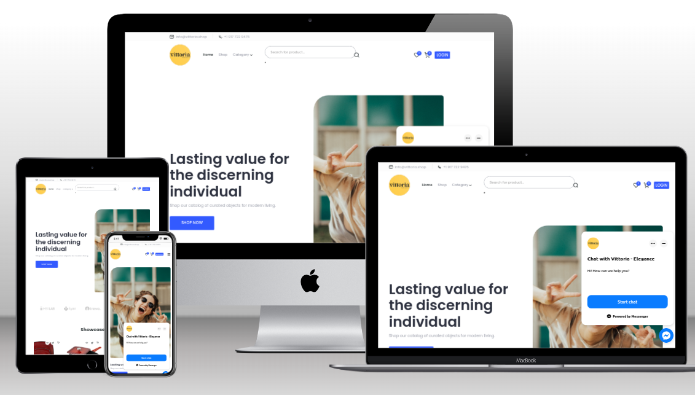
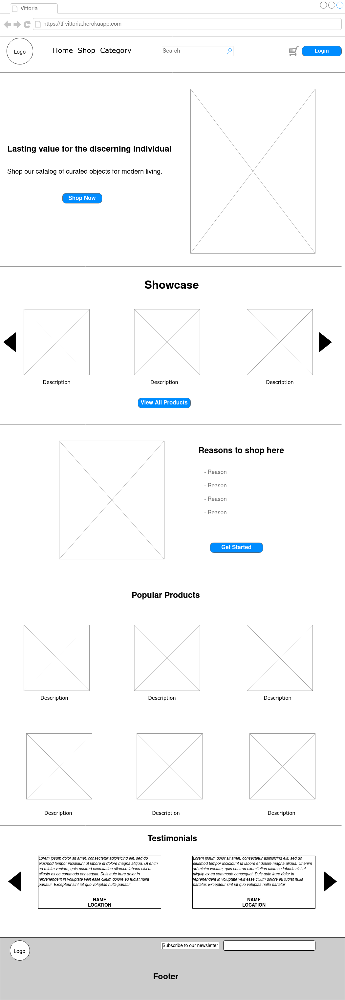
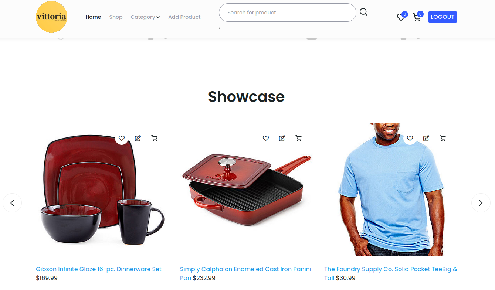
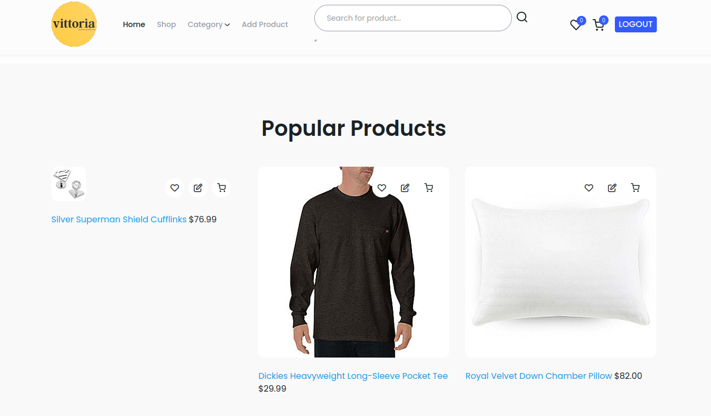
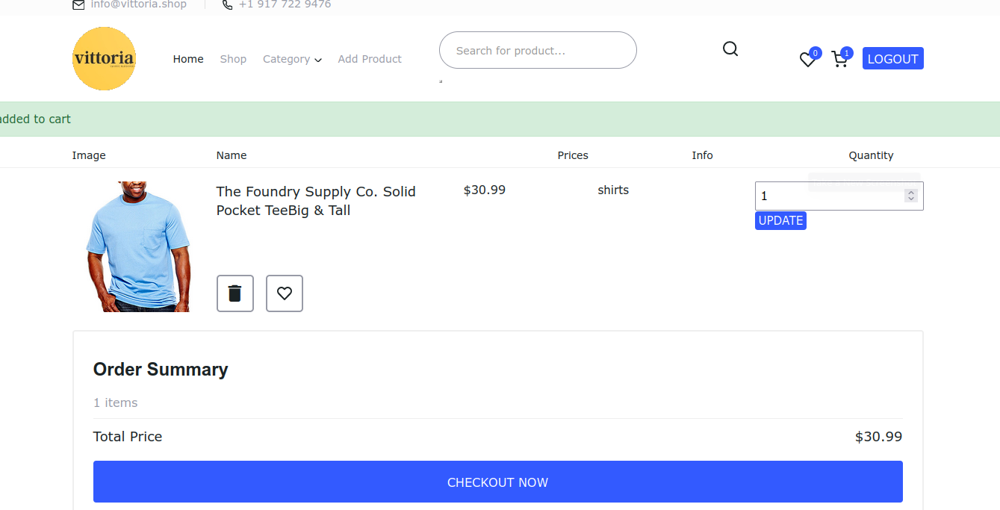
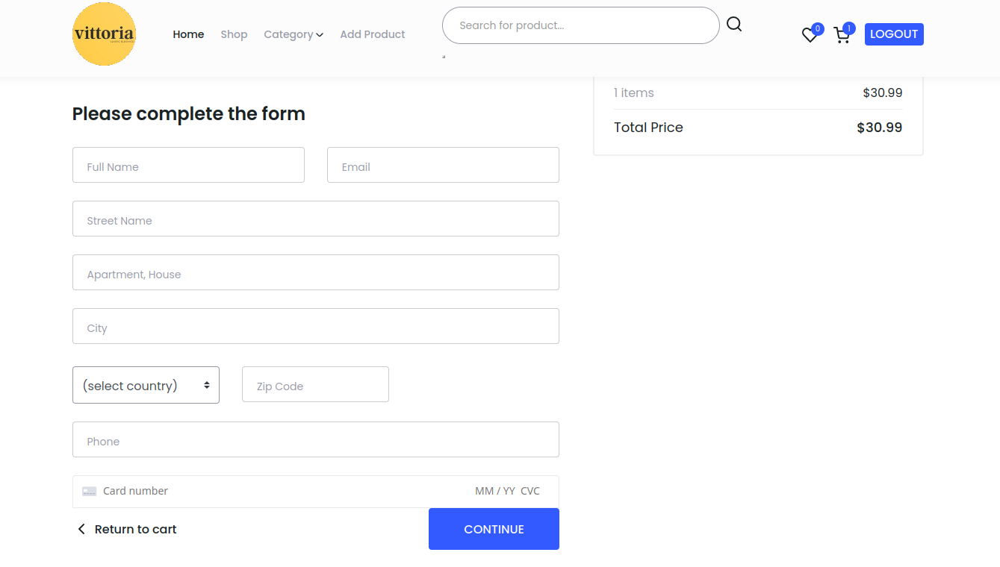

# Vittoria Ecommerce


## Introduction

Vittoria Ecommerce is an online store written using the Python Django Framework. It allows an individual to easily browse a catalog of clothing and household furnishings, select items to purchase, and to pay and arrange delivery, all in a secure and convenient manner. Throughout the process the individual can visibly track items in their shopping cart and see the amount due. Upon purchase, a confirmation email is sent.

For the store owner, a means is provided to edit and maintain the store catalog.

[Here is a link to the application](https://tf-vittoria.herokuapp.com/)

# Planning

## Initial Wireframe


I used [app.diagrams.net](https://app.diagrams.net) for the initial mockup. The sketch can be re-used or modified [here](docs/vittoria_app.diagrams.drawio)


## Features
#

- User login/logout with password reset.

- Product catalog maintenance for staff.

- Purchase items without creating an account.

- Live Chat (Facebook)

- Wishlist

- Add items to a favorites list.

- Newsletter

- Email confirmations.

- Responsive layout.

## Usage
#



Upon landing on the site main page, the shopper is presented with a carousel called the Showcase, to highlight items the shop is promoting. From there a user may click on a product so get more detail, add to the shopping cart or select one of the options to view items by category.



Similarly, a secondary feature shows up to nine items that are popular with shoppers, agin allowing them to select or add an item.

## Navigation
#


The following features sit in the top navigation area: 

- Proceed directly to the shop. 

- View products by category. 

- Add Product (N.B. visibly only to the shop Admin).

- Search for Product.

- View Favorites List.

- View Shopping Cart.

- Log in/out.

## Shopping Cart
#

#
The shopping cart displays a list of items that have been added for purchase. A shopper can remove items, change the quantity and proceed to checkout if desired.

## Checkout
#

#
On this page, the shopper confirms the amount payable, the shipping address, and the credit card information. This is passed securely to the Stripe Payment Processor, without any financial information saved in the store.


The above represents the basic workflow of the site. There are other features such as adding items to the favorites list, which is achieved by clicking on the heart symbol on the top right of each image, as well as a quick add to shopping cart, denoted by the cart symbol on each image.

A full login log out system, with password reset is provided.

A chat page, with a link to the store page is provided.


## Catalog Maintenance
#
If an Administrator logs in, a new category called 'Add Product' appears in the top navigation bar.
Additionally, an edit symbol is displayed over each existing item image, to allow the Admin, to edit or delete an item.

## Business Model
#
The objective of the store is to generate sales in the young adult market, by featuring products that are appealing to them, moderately priced, and delivering them in a timely fashion.

Social media such as Facebook, Twitter and Instgram are used to spread brand awareness.

Specials and promos are prominently featured.

A mailing list is maintaintained, kept relevant and regularly sent. Comments and feedback are actively sought.

Print media is used occasionaly in varying markets.

Goodie bags, promo items (stash) are given out at social events, such as night clubs, shopping malls etc.

Frequent meetings with suppliers and logistics firms to avail of new markets and opportunities.
## Facebook Page
#
[The Facebook page is here ](https://facebook.com/tf-vittoria)

## Platform
#

- AWS to store static files

- Elephant SQL for Postgres Database

- Stripe for payment system

- Heroku for Deployment

- Github, Gitpod, VS Code, Django

#
## Deployment
#
The project was deployed to Heroku, and in order to remain within the Free Tier,  the Postgres Database was hosted at Elephant SQL. Additionally, static and media files were hosted on Amazon Cloud. This combination allows for a free website, provided usage rates are not exceeded.

1. Create an [AWS S3 Bucket](https://aws.amazon.com/s3/) (For media)
2. Create an account at [Heroku](https://heroku.com) (For the Django App)
3. Create an account at [ElephantSQL](https://elephantsql.com) (Select "Tiny Turtle" for PostgreSQL tier).
4. Create an account at [Stripe](https://stripe.com) (Obtain Developer Keys)
5. When these elements are added, you will need to point the app to the correct values. This is done by setting the Config Variables (Reveal Config Vars) in Heroku:

| **Key** | **Value** |
--- | ---
 AWS_ACCESS_KEY_ID | your AWS bucket ID
 AWS_SECRET_ACCESS_KEY | your AWS secret key
 DATABASE_URL | your ElephantSQL Postgres database url
 EMAIL_HOST_PASS | your password to use your gmail account for emails
 EMAIL_HOST_USER | your email address
 SECRET_KEY | secret key used for your Django project
 STRIPE_PUBLIC_KEY | obtained through your Stripe account
 STRIPE_SECRET_KEY | obtained through your Stripe account
 STRIPE_WH_SECRET | obtained through your Stripe account
 USE_AWS | True

6. In you Git root folder, create a requirements.txt file with the following command:
```
pip3 freeze --local > requirements.txt
```
7. Create a Procfile as follows:
```
echo web: gunicorn vittoria.wsgi:application > Procfile
```
8. The Postgres database is initialised and sync'd with these commands:
```
python3 manage.py makemigrations
python3 manage.py migrate
```
9. Create a superuser.
```
python3 manage.py createsuperuser
```
10. Log in to Heroku from the terminal using this command and enter your details when prompt:
```
heroku login -i
```
11. Once logged in, link your Heroku app created above as the remote repository with this command:
```
heroku git:remote -a <your app name here>
```
12. Complete the deployment by pushing the projekt to Heroku:
```
git push heroku main
``` 
#
## Testing
### General

- Tested for responsiveness on desktop and mobile platforms.

- Automated Python tests in the application.

- Multiple purchases made during testing, to check input validation, arithmetic calculations, and credit card processing. No errors were found.

### Logical Testing

- The Home folder contains a tests.py containing the following test cases. They complete without error.

```
class RobotsTest(TestCase):
    def test_get(self):
        response = self.client.get("/robots.txt")

        self.assertEqual(response.status_code, HTTPStatus.OK)
        self.assertEqual(response["content-type"], "text/plain")
        lines = response.content.decode().splitlines()
        self.assertEqual(lines[0], "User-Agent: *")

    def test_post(self):
        response = self.client.post("/robots.txt")

        self.assertEqual(response.status_code, HTTPStatus.METHOD_NOT_ALLOWED)

class SignupFormTest(TestCase):
    def test_form_validation(self):
        form = SignupForm({
            'email': 'test@example.com',
            'username': 'admin',
            'password1': 'vittoria@user',
            'password2': 'vittoria@user',
        })
        
        self.assertTrue(form.is_valid())
      
        
    def test_form_invalid_missing_email(self):
        form = SignupForm({
            'username': 'testuser',
            'password1': 'password',
            'password2': 'password',
        })
        self.assertFalse(form.is_valid())
        self.assertEqual(form.errors['email'], ['This field is required.'])

class EditProductFormTest(TestCase):
    def setUp(self):
        self.product = Product.objects.create(
            name='test product',
            description='test description',
            price=10.99,
        )

    def test_form_validation(self):
        form = EditProductForm(data={'name':'test product', 'description':'test description', 'price':10.99}, instance=self.product)
        self.assertTrue(form.is_valid())
    
    def test_form_invalid_missing_name(self):
        form = EditProductForm({
            'description': 'test description',
            'price': 10.99,
        }, instance=self.product)
        self.assertFalse(form.is_valid())
        self.assertEqual(form.errors['name'], ['This field is required.'])

class NewsletterFormTest(TestCase):
    def test_form_validation(self):
        form = NewsletterForm({
            'emails': 'test@example.com',
        })
        self.assertTrue(form.is_valid())

```
### CSS Testing

- Running the site through [The W3C Validation Service](https://jigsaw.w3.org/css-validator/validator?uri=https%3A%2F%2Ftf-vittoria.herokuapp.com%2F&profile=css3svg&usermedium=all&warning=1&vextwarning=&lang=en) produces only one error message related to Font Awsome, and a bug report exists on Github at https://github.com/FortAwesome/Font-Awesome/issues/19423

## Compatibility Testing
### Using different browsers

The project has been  tested on the following web browsers, checking that all aspects worked as planned:

    Google Chrome
    Mozilla Firefox
    Apple Safari

### Using different devices

I tested this project on these devices:

    Acer Desktop on KDE Linux
    Apple iPhone 6
    Android 12 Poco Phone
    Android 11 Tablet 
    Lenove Laptop using Windows 10


## Attribution
#

The first source is Code Institute, whose ecommerce tutorial was indispensible.
In addition, I had the benefits of a mentor Ashit, and a fellow student Atit, who provided useful guidelines and hints.
Google, Slack, Stack Overflow were geat sources of specific code snippets and examples which aided me.
I would like to thank all who assisted me in this project.


# Marketing Plan
## Target Audience


Age: 21-35 years old

Gender: Male and Female

Location: United States (but other Englidh speaking countries also).

Income: $30,000 - $75,000 annually

Interests: Fashion, Technology, Health and Wellness, Social Media

By pursuing this target audience, the Vittoria ecommerce will tailor its marketing efforts to speak directly to this group's interests and needs, and create content that will resonate with them. This will increase the chances of driving traffic to the website and converting that traffic into sales.

## Marketing Goals
#

- Increase website traffic by 25% in the next quarter through SEO optimization, paid search ads, and content marketing.

- Increase sales revenue by 20% within the next six months through email marketing campaigns and social media advertising.

- Boost customer engagement by 15% by the end of the year through social media engagement, influencer partnerships, and user-generated content and reviews.

By setting these specific goals, Vittoria ecommerce can better measure the success of its marketing efforts and make informed decisions about future strategies. Each of these goals is measurable, has a set timeline, and is designed to help the business achieve its overall objectives.

## Competitors
#

- Identify key competitors in the same niche and research their marketing strategies, including the channels they use to reach their target audience and the types of content they create.

- Analyze the strengths and weaknesses of each competitor's marketing efforts and identify areas where the ecommerce store can differentiate itself from the competition.

- Monitor competitors' pricing strategies, promotions, and customer reviews to better understand how they are meeting the needs of their customers and where they may be falling short.


## Brand Identity
#

- Vittoria ecommerce store's brand identity will reflect its mission, values, and personality.

- The brand will have a clear and consistent message that resonates with the target audience.

- Vittoria ecommerce will have a unique and recognizable logo and color scheme that distinguishes it from competitors.

- The brand's messaging will be consistent across all channels, including social media, email marketing, and the website.

## Marketing Channels
#

## Social Media Marketing

- Vittoria ecommerce will use social media platforms such as Instagram, Facebook, and Twitter to promote its products and connect with its target audience.

## Email Marketing 
- The store will create an email list of subscribers and send out weekly newsletters featuring new product releases, promotions, and other updates.

## Content Marketing 
- The store will create blog posts and video content to provide valuable information and engage its audience, driving traffic to the website.

## Influencer Marketing
- The store will partner with relevant influencers on social media platforms to promote its products to their followers.

## Paid Advertising 
- The store will invest in paid search ads and social media ads to reach a wider audience and drive traffic to the website.


## Marketing Budget
- The budget in year one is $50,000, to be spent as follows:

### Social Media Marketing: $15,000
- The store will allocate the largest portion of its budget to social media marketing. This will include paying for sponsored posts and ads on Facebook, Instagram, and Twitter to promote its products and reach a wider audience.

### Email Marketing: $5,000
- The store will also invest in email marketing to promote its products and keep subscribers engaged. This will include creating a weekly newsletter featuring new products, promotions, and other updates.

### Content Marketing: $10,000 
- The store will create high-quality blog posts, product videos, and other content to engage its audience and attract new customers. This will include contracting a content team to produce the content.

### Influencer Marketing: $10,000 
- The store will partner with relevant influencers to promote its products to their followers. This will include paying for sponsored posts and product reviews on social media platforms.

### Paid Advertising: $10,000 
- The store will invest in paid search ads and social media ads to drive traffic to the website and reach a wider audience.

## Measurement and Optimization

- Usage of web analytics and conversion tracking to measure website traffic, customer engagement, and sales conversions. This will help to determine the effectiveness of each marketing channel and identify areas for improvement.

- Review of marketing plan on a regular basis, and making adjustments based on performance data to optimize the marketing efforts. This may involve shifting budget allocations to the most effective channels, adjusting the messaging or creative used in ads, or trying new marketing tactics.

- Usage A/B testing to test different marketing messages and tactics to determine the most effective strategies for reaching the target audience and driving sales.

- Monitoring of customer feedback, including reviews and comments on social media and other platforms, to identify areas for improvement and adjust the marketing plan accordingly.
#